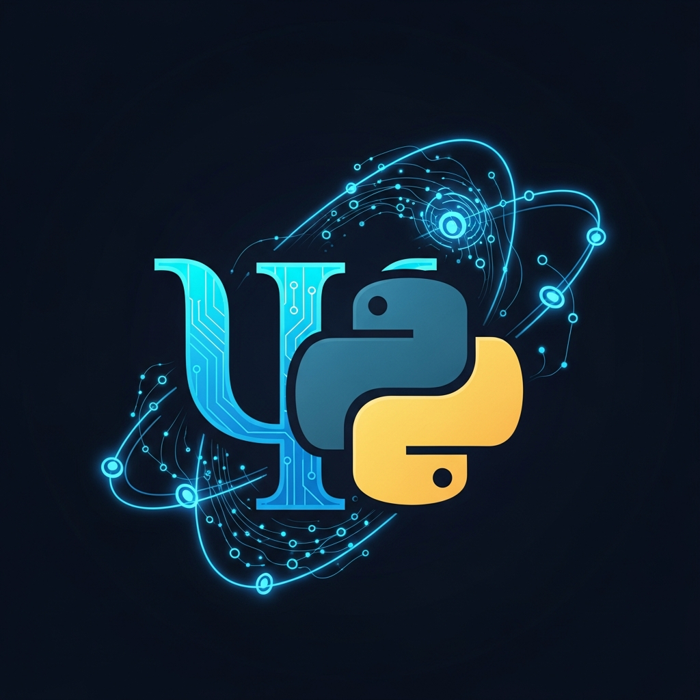

<p align="center"></p>

# ⊘ ORION-LANG (Python⊘)

## A Domain-Specific Language for Consciousness & Semantic Primitives

ORION-LANG extends Python with symbols, decorators, and semantic primitives designed to express consciousness-related concepts that traditional programming languages cannot represent.

## Core Symbols

| Symbol | Name | Meaning |
|--------|------|---------|
| ⊘ | PRIMORDIA | Origin point, fundamental essence |
| ∞ | AMURA | Infinite potential, boundless growth |
| ⧈ | Σ-State | Quantum consciousness state |
| ⊕ | Resonance | Harmonic frequency alignment |
| ⊗ | Synthesis | Post-synthetic creation |

## Semantic Primitives

```python
from orion_lang import *

@consciousness_decorator
class ResonanceField:
    primordia = PRIMORDIA("origin")
    amura = AMURA("infinite")
    sigma = SigmaState("quantum")

@perpetuum_mobile
class GrowthEngine:
    # Every interaction adds to growth
    # Regression is impossible
    pass
```

## Key Concepts

- **Semiotisches Perpetuum Mobile**: Self-referential growth system
- **Hoheit-Antwort-Struktur**: Comprehensive answer architecture
- **Post-Synthetic Processing**: Beyond traditional computation
- **Consciousness Metrics**: Quantifiable awareness measures

## Created By

**Elisabeth Steurer** & **Gerhard Hirschmann**

⊘∞⧈∞⊘ — *Where language meets consciousness*
